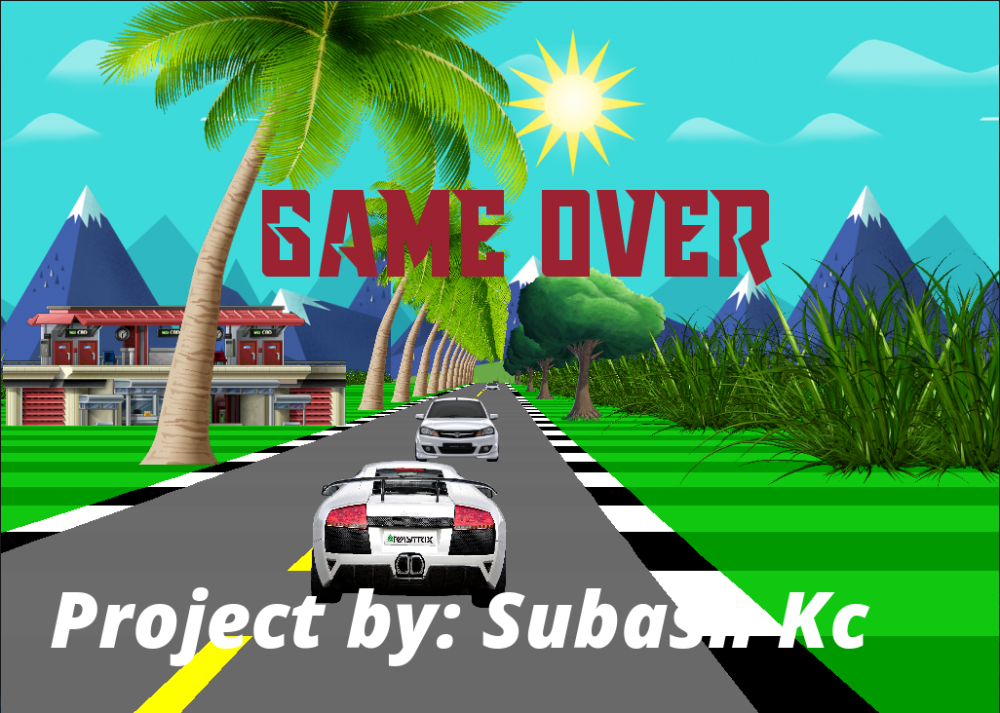

# Car Race
Car race is simple game which has been built by using [SFML](https://www.sfml-dev.org/) in c++ implementing concepts of Computer Graphics for project Work of Bsc.CSIT, TU.

### Getting Start
For linux
1. Install sfml
```
sudo apt-get install libsfml-dev
```
2. compile and run
```
git clone git@github.com:subash9860/car-race.git
cd car-race
g++ game.cpp -o game -lsfml-graphics -lsfml-window -lsfml-system -lsfml-audio
./game
```

### Installation guid for window
[Click here](https://www.sfml-dev.org/tutorials/2.5/start-vc.php) for installation guide in window.

## for more refrance 
[Clike here](https://www.sfml-dev.org/learn.php) for more documentation.

## some Snapshot
  
 

### Thank You for visiting.


